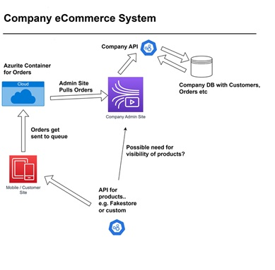

# C# Azure eCommerce Challenge

## Learning Objectives

- Understand how to create a full stack application that interacts with Azure (Azurite) services
- Understand how to create an Azurite container in Docker to simulate Azure features
- Understand code to interact with Azure Tables, Queues, Blobs, Function etc

## Instructions

1. Fork this repository
2. Clone your fork to your machine
3. Pull an Azurite image: `docker pull mcr.microsoft.com/azure-storage/azurite`
4. Execute: `docker run -p 10000:10000 -p 10001:10001 -p 10002:10002 mcr.microsoft.com/azure-storage/azurite`
5. Install the [Microsoft Azure Storage Explorer](https://azure.microsoft.com/en-us/products/storage/storage-explorer/)
6. Now connect to the container using [Microsoft Azure Storage Explorer]()

## Core

For this exercise you are required to create a full stack ecommerce application utilising Azurite to simulate Azure services.

Below is a **_guide_** of the application parts. You can change within reason and with justification!:

#### Customer Front End

- Customer has a front end in either React or Angular
- Customer can see products from an API endpoint like [fakestore api](https://fakestoreapi.com/products), something similar or make your own (see below).
- Customer adds products to a basket
- Customer places an order
- Customer orders should be sent to an Azure Table Storage (using Azurite) directly or through an API
- Customer can view their orders, cancel order, amend order and see order history
- Customer can update their address

#### Admin Front End

- Employee has a front end in either React or Angular
- Employee can view customer orders
- Employee can view orders in the Azure Table Storage
- Employee can process orders as dispatched

#### Company API

- Process orders from Azure (Azurite) through the Company API to a company database (could be a postgres container, in memory, neon etc)

#### API for Products

- This can be a simple API that returns a list of products. Could be merged with the Company API or kept serparate

#### Design Overview

**_Note:_** This is a guide as the apis/websites might send/receive data to different enpoints

## Extensions

- Each product has a stock level stored in the company database. When a product is added to the basket, the stock level should be checked. If the stock level is 0, the product should not be able to be added to the basket. On order, the stock level should reduce accordingly.

## Super Extension

- Dockerize the application with Docker compose for anything you feel can be containerized

## Notes

- Further information about the [Microsoft Azurite Storage Emulator](https://learn.microsoft.com/en-us/azure/storage/common/storage-use-azurite?tabs=visual-studio%2Cblob-storage)
- Lots of Azure code can be found on the official repository [Azure SDK for .Net](https://github.com/Azure/azure-sdk-for-net)
- Use some of this code to interact with Azure services [csharp-cloud-azure-code-examples](https://www.github.com/boolean-uk/csharp-cloud-azure-code-examples)
